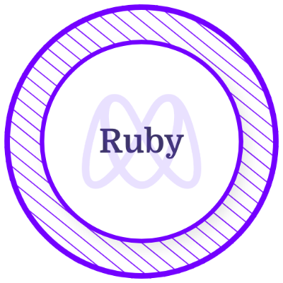

<h1 align="center"> Hi Fellow Devs 
 
 , I am Rao Akif </h1>

<h3 align="center">  Full Stack Web Developer </h3>

 

  

 

<h3 align="center"> 👨‍💻 My Technology Stack </h3>
 

 
  </a> 

 
 
 

<h3 align="center">  Microverse Certifications </h3>
<table align="center">
  <tr>
    <td align="center"></td>
    <td align="center"></td>
    <td align="center"></td>
    <td align="center"></td>
    <td align="center"></td>
    <td align="center"></td>
  </tr>
</table>

 
 
